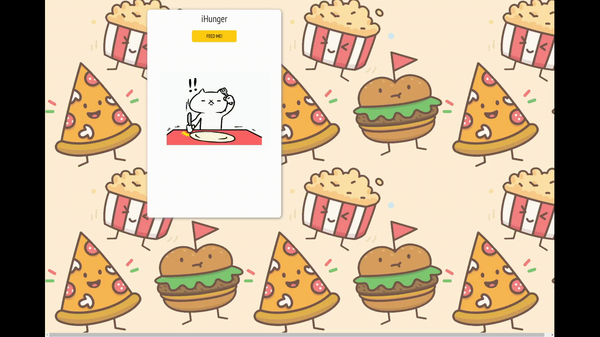

<h1 align="center">iHunger</h1>

### Introduction
A random meal generator app that was meant to be a small app project done within two days.

### Features
1. A random meal generated by a button.
2. An expandable recipe list
   * A list of ingredients
   * A step-by-step recipe guide
   * A Youtube recipe video 
3. A Favorites List and Add button
   * Persistant list of stored favorites
   * Delete button
   * View meal/recipe upon clicking name

### Technologies
* Front-end:
  * React.js, HTML/CSS, CSS Flexbox
* Back-end:
  * Express.js, Node.js, MongoDB/Mongoose
* Tools:
  * TheMealDB API
